# Pet Social Network

A full-stack social networking application for pet owners, built with Node.js and Express. Users can create profiles for their pets, share posts with photos, follow other pet owners, and interact through likes and comments, all within a clean, responsive interface.

## Live Application

**Main Site:** [pet-social-app.up.railway.app](https://pet-social-app.up.railway.app)

## Screenshots

| Desktop | 
|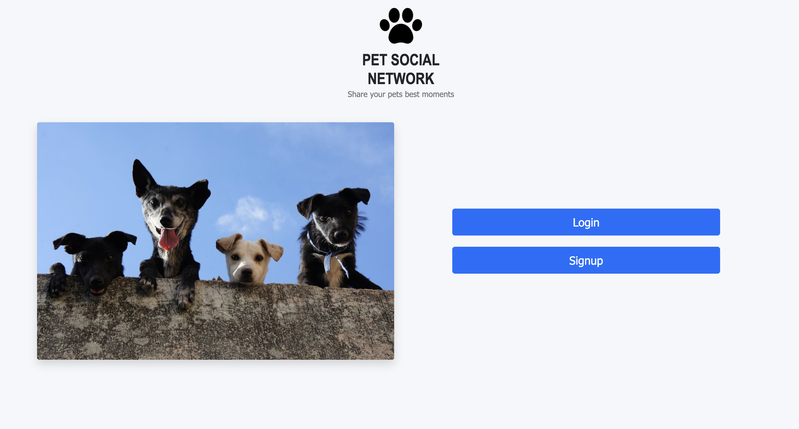 |
|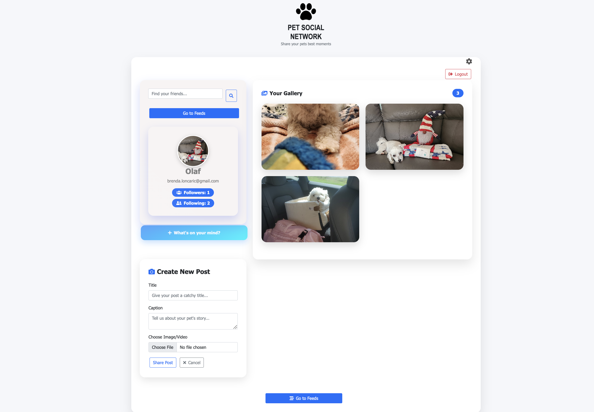 |
|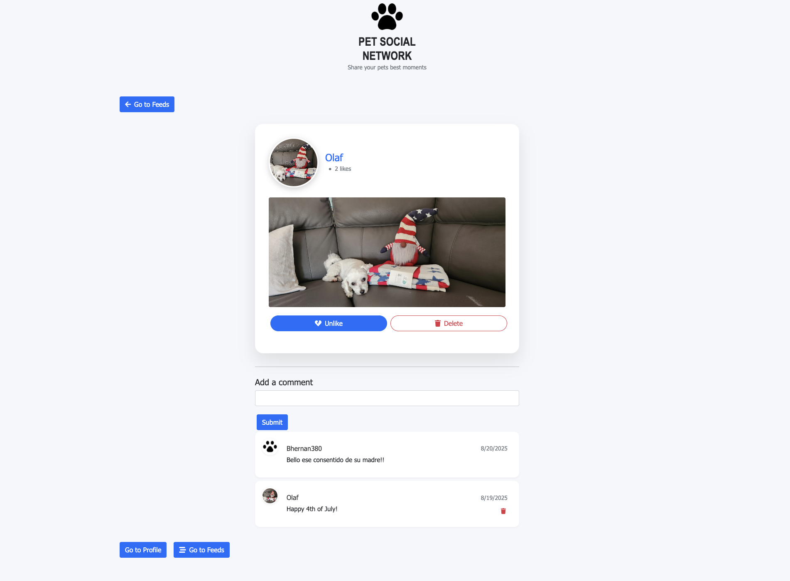 |
|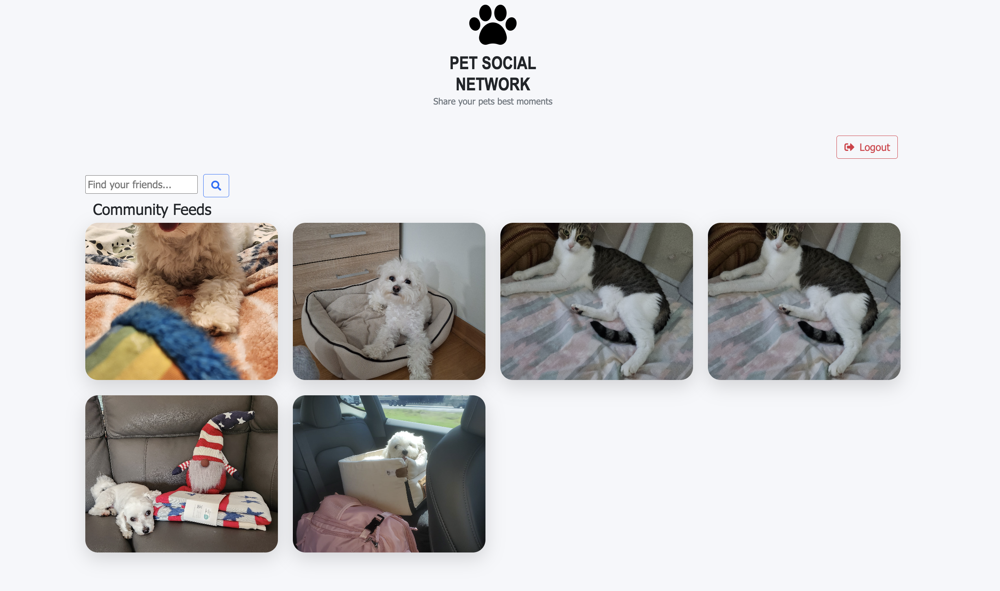 |
|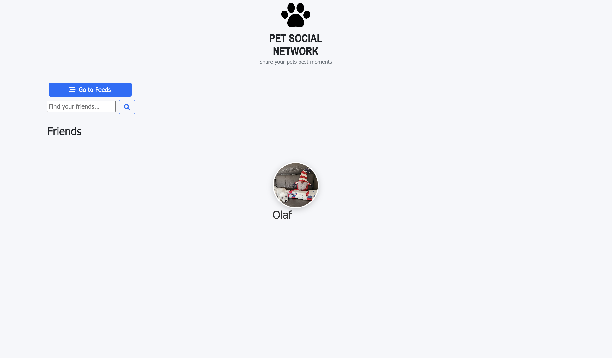 |
|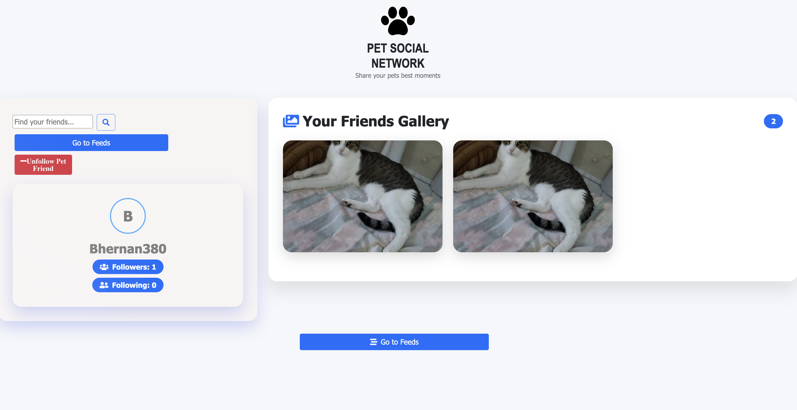 |
|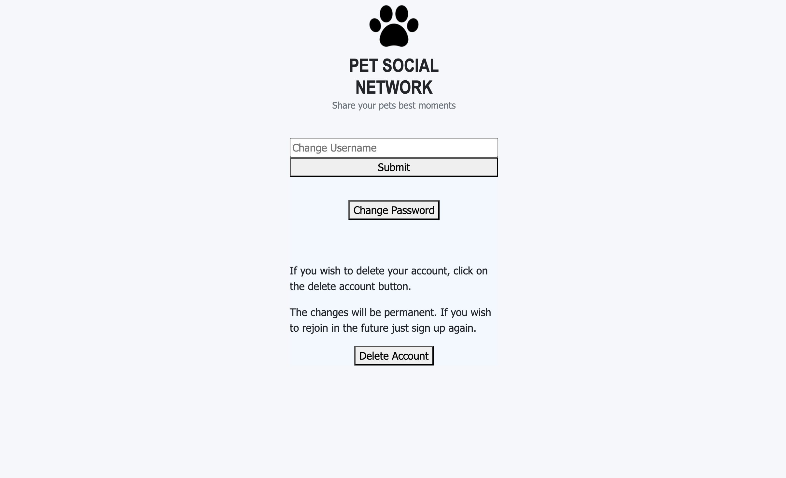 |

| Mobile | 
||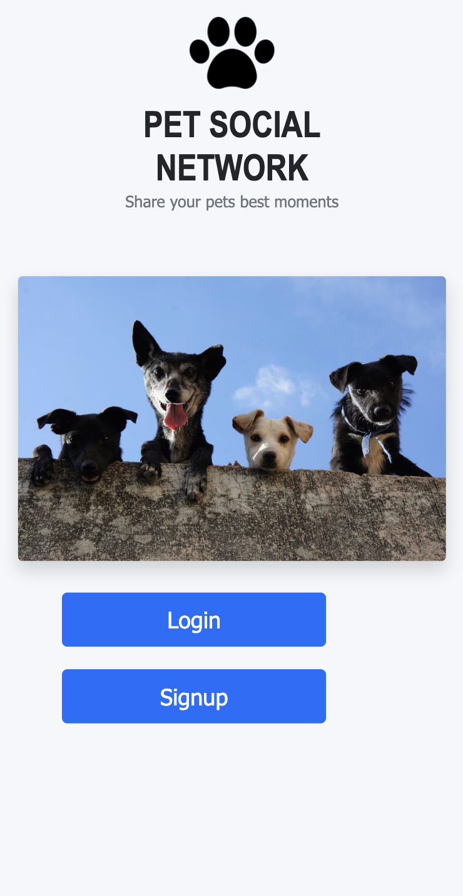|
|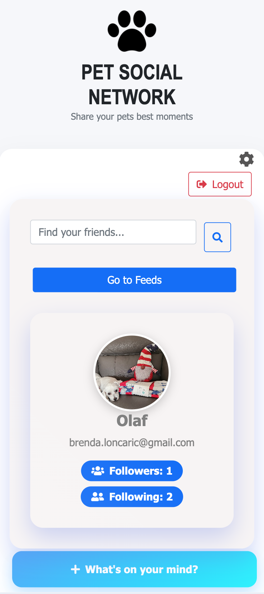 |
|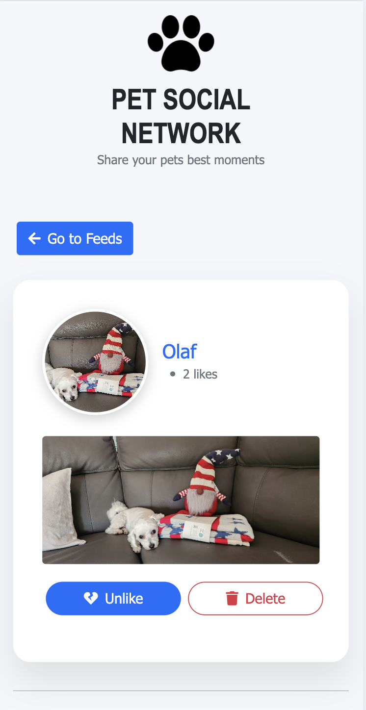 |
|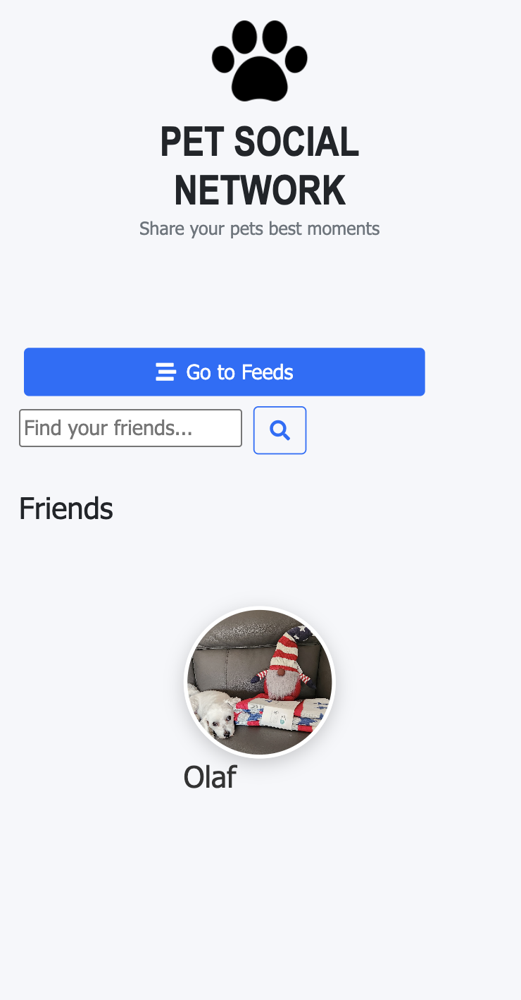 |
|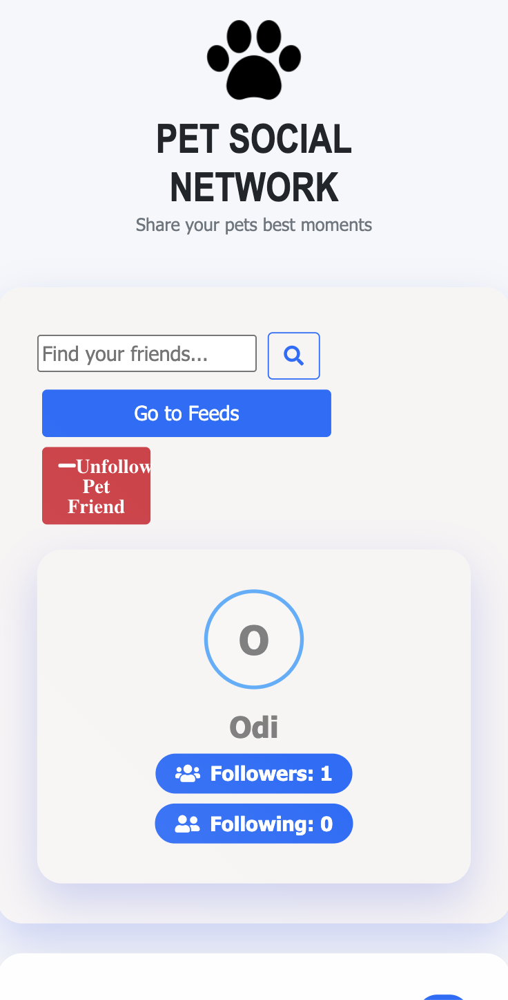 |
|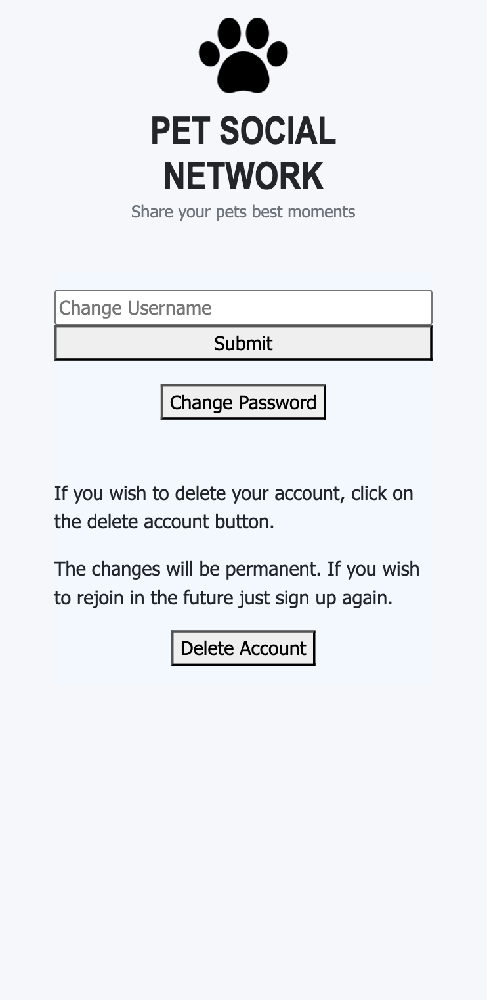 |

### Features

- **Authentication:** Secure sign up, login, and logout with session persistence
- **Pet Profiles:** Create and personalise your pet's profile with a custom profile picture
- **Photo Posts:** Share moments by uploading images directly to your feed
- **Social Feed:** Browse posts from all the pet owners you follow in one place
- **Likes:** Like and unlike posts from other users
- **Comments:** Leave comments on any post and delete your own
- **Follow System:** Follow and unfollow other pet owners to curate your feed
- **Search:** Find other users and posts across the platform
- **Responsive Design:** Fully mobile-friendly interface across all devices

### Account Management

- **Settings:** Update your display name or delete your account entirely
- **Forgot Password:** Request a password reset link sent to your email
- **Reset via Email:** A secure time-limited token link lets you set a new password without logging in
- **Change Password:** Update your password directly from within the app when logged in

### Email Notifications

Powered by Mailgun. When you request a password reset, you receive:

- A secure, time-limited reset link (expires in 1 hour)
- A branded email from the Pet Social Network

## Technology Stack

| Layer | Technologies |
|---|---|
| Backend | Node.js, Express.js 4 |
| View Engine | EJS |
| Styling | CSS, vanilla JS |
| Database | MongoDB, Mongoose |
| Auth | Passport.js (local strategy), express-session, connect-mongo |
| File Upload | Multer, Cloudinary |
| Email | Mailgun.js |
| Testing | Jest, Supertest |
| Linting | ESLint (Standard config) |
| Deployment | Railway (Nixpacks) |
| CI/CD | GitHub Actions |

## Key Features

### Profile & Image Uploads
Users can upload a profile picture and attach images to any post. Files are handled by Multer on the server and stored via Cloudinary, keeping the database lean and delivery fast.

### Follow System
Each user has a list of people they follow. The social feed is scoped to those connections, so content stays relevant. Following and unfollowing updates in real time.

### Password Reset Flow
Forgot password triggers a Mailgun email containing a unique token link. The link opens a reset form pre-scoped to that token. Tokens expire after one hour for security. Logged-in users can also change their password directly through the settings flow.

## CI/CD Pipeline

- **CI:** ESLint and Jest test suite run on every push and pull request
- **CD:** Automatic deploy to Railway on every merge to `main`
- **Security:** GitLeaks secret scanning and `npm audit` run in the pipeline

## Pages & Navigation

| Route | Page |
|---|---|
| `/` | Home — landing page |
| `/signup` | Create a new account |
| `/login` | Log in to your account |
| `/feed` | Social feed (auth required) |
| `/profile` | Your pet profile (auth required) |
| `/settings` | Edit name or delete account (auth required) |
| `/search` | Search posts and users (auth required) |
| `/posts/:id` | View a single post (auth required) |
| `/friends/:id` | View another user's profile (auth required) |
| `/forgot-password` | Request a password reset email |
| `/reset-password/:token` | Set a new password via email link |
| `/changePassword` | Change password while logged in (auth required) |
| `/newPassword` | Set updated password (auth required) |
| `/health` | Health check endpoint |

## CI/CD Pipeline

The application includes comprehensive CI/CD with:

### Continuous Integration (`ci.yml`)
- **Linting**: ESLint with Standard configuration
- **Security Scanning**: GitLeaks for secret detection
- **Dependency Audit**: npm audit for vulnerability scanning
- **Testing**: Jest test suite
- **Triggers**: Push to main/develop, Pull requests to main

### Continuous Deployment (`deploy.yml`)
- **Development**: Auto-deploy from `develop` branch
- **Production**: Auto-deploy from `main` branch
- **Health Checks**: Automated endpoint monitoring
- **Release Management**: GitHub releases for production deployments

### Security Features
- Secret scanning with GitLeaks
- Dependency vulnerability checking
- Environment variable validation
- Graceful shutdown handling
- Railway deployment optimizations

## API Endpoints

### Authentication
- `GET /` - Home page
- `GET /login` - Login page
- `POST /login` - Login user
- `GET /signup` - Signup page
- `POST /signup` - Register user
- `GET /logout` - Logout user

### Posts
- `GET /feed` - View feed
- `GET /profile` - User profile
- `POST /post/createPost` - Create new post
- `PUT /post/likePost/:id` - Like/unlike post
- `DELETE /post/deletePost/:id` - Delete post

### Friends
- `POST /friends/addFriend` - Send friend request
- `POST /friends/acceptFriend` - Accept friend request
- `GET /friends/findFriends` - Find new friends

### Health Check
- `GET /health` - Application health status

## Project Structure

```
├── __test__/              # Test files
├── config/                # Configuration files
│   ├── database.js        # Database connection
│   └── passport.js        # Passport configuration
├── controllers/           # Route controllers
├── middleware/            # Custom middleware
├── models/                # Mongoose models
├── public/                # Static assets
├── routes/                # Express routes
├── views/                 # EJS templates
├── .github/workflows/     # CI/CD pipelines
├── server.js              # Application entry point
└── package.json           # Dependencies and scripts
```
## Future Enhancements

- [ ] Migrate frontend from EJS server-side rendering to a React SPA (Vite + React Router), keeping the existing Express API as a backend
- [ ] Direct messaging between users
- [ ] Notifications for new likes, comments, and followers
- [ ] Pet breed tags and filtering
- [ ] Fix settings
- [ ] Fix feed UI


